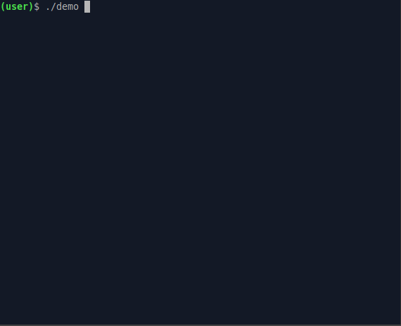

## Improved Lightweight Embedded Command Line Interface

![][logo]

[logo]: ./logo.png

Console user interface for MCU, RTOS, and C applications with tab
completions for each of the command tree nodes.

Integrate it into your project as a submodule. Use this to create a
complex management plane for your application with many branches and
command tree nodes.

Build and run a small Linux application [demo](demo/README.md) to test the interface.
